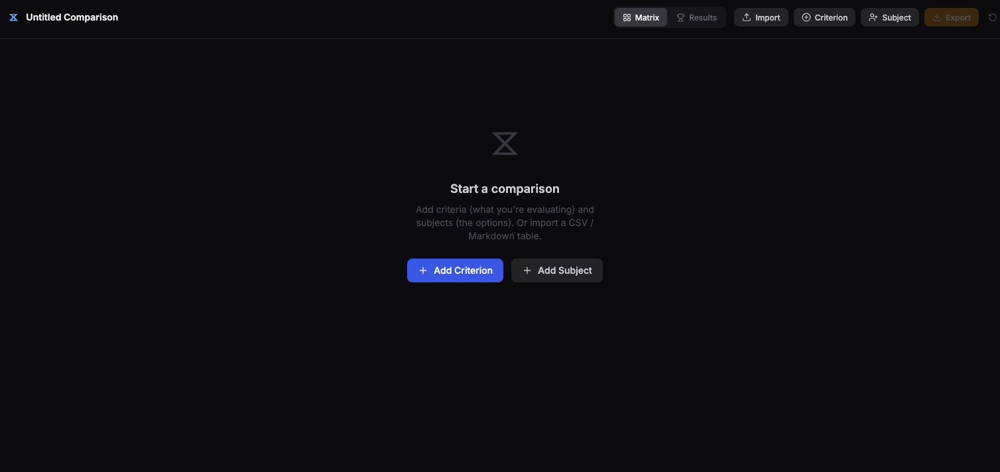
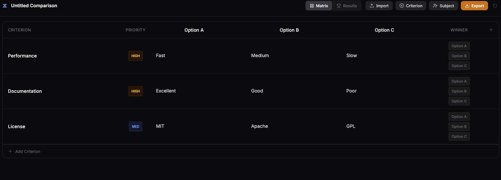

# Janus Coin

A browser-based **Multi-Criteria Decision Analysis (MCDA)** tool for structured decision-making. Compare options across weighted criteria, track per-criterion winners, and export results as a Markdown report.

Live: [janus-coin.thewintershadow.com](https://janus-coin.thewintershadow.com)

---

## Overview

### The problem

Every significant decision involves the same underlying challenge: you're evaluating multiple options against multiple criteria, and those criteria don't all matter equally. Which car to buy, which apartment to rent, which job offer to take, which Python package to pull into a project, which product to purchase — the surface domains are different, but the problem structure is identical every time.

Without a tool built for this, decisions get made informally — a handful of browser tabs, a scattered notes file, a mental checklist that quietly drops variables. The result is a decision that might be right but can't be explained, audited, or revisited later. When you change your mind in six months, you have no record of what tradeoffs you accepted or why.

The specific failure mode this addresses: **structured thinking that doesn't survive contact with complexity.** A side-by-side spreadsheet works for two options and three criteria. It breaks down when you have five options, eight criteria, and you want to weight security differently than cost differently than developer ergonomics.

### The requirements

Before building, the problem space was mapped across three architectural approaches:

1. **Local knowledge base** (Obsidian + Dataview) — keeps data private and integrated with existing notes, but weak on weighted math and too manual for complex comparisons.
2. **Dedicated SaaS or spreadsheet** (Airtable, Notion, Google Sheets) — fast setup, but data lives in a cloud silo with no control over the underlying logic.
3. **Custom self-hosted tool** — total control over scoring algorithms, data stays private, exportable to any format.

The custom route won on four key requirements:
- **Glass-box math** — weighted scoring visible and auditable, not hidden behind a vendor's UI
- **Obsidian-native export** — final decisions archived as `.md` files with YAML frontmatter, directly importable into a personal vault
- **Privacy** — no comparison data leaving infrastructure you control
- **Extensibility** — room to add API integrations (live GitHub metrics, pricing data, etc.) later

### What was built

The original architecture spec included a Python (FastAPI) backend on GCP Cloud Run for weighted scoring calculations and external API fetching, with Terraform for infrastructure. The frontend was the same React + TypeScript + Zustand stack.

In practice, the weighted math and Markdown generation turned out to be straightforward enough to run entirely in the browser — no round-trip to a server needed. The current implementation is a **fully client-side app** deployed to GitHub Pages: no backend, no infrastructure to maintain, zero idle cost. The API integration layer is the natural next extension when that requirement becomes concrete.

The core value proposition holds either way: a structured, exportable, weighted decision matrix that lives in your browser and outputs directly to your knowledge base.

---

## Screenshots





---

## What it does

Janus Coin gives you a decision matrix where rows are **criteria** (what you care about) and columns are **subjects** (the options you're comparing). Each criterion has a priority weight — High, Medium, or Low — that feeds into the results scoring.

**Core workflow:**

1. Add criteria and subjects manually, or import from CSV / Markdown table
2. Fill in each cell with your evaluation text; optionally color-code cells (Positive, Neutral, Caution, Negative, Notable, Alt)
3. Mark a winner per criterion in the matrix
4. Switch to the **Results** view to see a weighted winner tally
5. Declare an overall final winner, then export the full comparison as a `.md` file

**Import:** paste a CSV or Markdown table with columns `Criterion | Importance | Subject A | Subject B | ...`. The `Importance` column is optional — it defaults to Medium if omitted.

**Export:** generates a Markdown file with YAML frontmatter, the comparison matrix table, a weighted winner tally, and any notes. Compatible with Obsidian and other Markdown tools.

---

## Tech stack

| Layer | Choice |
|---|---|
| Framework | React 18 + TypeScript |
| Build | Vite |
| State | Zustand |
| Styling | Tailwind CSS |
| Icons | Lucide React |
| Deploy | GitHub Pages |

---

## Local development

```bash
cd frontend
npm install
npm run dev
```

The dev server runs at `http://localhost:5173`.

```bash
npm run build   # production build
npm run preview # preview the production build locally
```

---

## Deployment

Pushes to `main` trigger a GitHub Actions workflow that builds the frontend with `VITE_BASE_PATH=/` and deploys the `dist/` directory to GitHub Pages. The custom domain `janus-coin.thewintershadow.com` is configured via `frontend/public/CNAME`.
